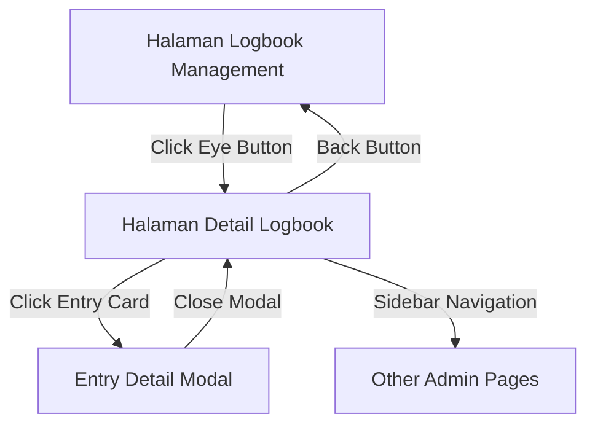

# ✅ IMPLEMENTASI SELESAI - Halaman Detail Logbook

## 🎯 Ringkasan Implementasi

Halaman detail logbook telah berhasil dibuat dengan semua fitur yang diminta:

1. **✅ Button Mata Navigation**: Di halaman manajemen logbook, tombol mata sekarang mengarah ke halaman detail
2. **✅ Header Informasi Umum**: Menampilkan nama, deskripsi, statistik logbook
3. **✅ Data Entries Display**: Semua data yang dimasukkan user ditampilkan dengan dua mode (Card & Table)
4. **✅ Sidebar Integration**: Menggunakan layout yang sama dengan halaman induk
5. **✅ API Integration**: Sepenuhnya menggunakan HTTP API Controller yang sudah ada

---

## 🔧 Files yang Dibuat/Dimodifikasi

### 1. **Route Baru** ✅
**File**: `routes/web.php`
```php
// Menambah route untuk detail logbook
Route::get('/logbook/{id}', function() { 
    return view('admin.logbook-detail'); 
})->name('admin.logbook-detail');
```

### 2. **Function Navigation Update** ✅
**File**: `resources/views/admin/logbook-management.blade.php`
```javascript
function viewTemplate(templateId) {
    // Navigate to logbook detail page
    window.location.href = `/admin/logbook/${templateId}`;
}
```

### 3. **Halaman Detail Logbook Baru** ✅
**File**: `resources/views/admin/logbook-detail.blade.php`

---

## 🌟 Fitur-Fitur Halaman Detail

### **Header Informasi Logbook**
- ✅ **Nama & Deskripsi** logbook
- ✅ **Creator & Tanggal** pembuatan
- ✅ **Statistik Cards**: Total entri, penulis, entri terverifikasi, entri terbaru
- ✅ **Button Refresh** untuk update data

### **Filter & Controls**
- ✅ **Filter Penulis**: Dropdown dengan semua penulis yang ada
- ✅ **Filter Tanggal**: Range picker (dari - sampai)
- ✅ **Filter Verifikasi**: Status verifikasi (semua/terverifikasi/pending)
- ✅ **Sorting**: Terbaru, terlama, update terbaru
- ✅ **View Mode**: Toggle antara Card view dan Table view

### **Display Data Entries**
- ✅ **Card View**: Grid cards dengan preview data dan status verifikasi
- ✅ **Table View**: Tabel lengkap dengan semua field data
- ✅ **Image Handling**: Deteksi dan display gambar dengan proper preview
- ✅ **Responsive Design**: Adaptif untuk mobile dan desktop

### **Detail Modal**
- ✅ **Entry Detail**: Modal pop-up dengan detail lengkap setiap entry
- ✅ **Writer Information**: Info penulis lengkap
- ✅ **Timestamps**: Tanggal buat dan update
- ✅ **Verification Status**: Status dan catatan verifikasi
- ✅ **Full Data Display**: Semua field data dengan formatting yang proper

### **Pagination & Loading**
- ✅ **Pagination**: Navigation dengan info halaman
- ✅ **Loading States**: Skeleton loading untuk UX yang baik
- ✅ **Error Handling**: Proper error messages dan fallbacks

---

## 🔗 API Integration

### **Endpoints yang Digunakan**:

| API Endpoint | Fungsi | Controller |
|-------------|--------|------------|
| `GET /api/templates/{id}` | Data template dasar | LogbookTemplateController |
| `GET /api/logbook-entries/template/{id}/summary` | Statistik template | LogbookDataController |
| `GET /api/logbook-entries/template/{id}` | Data entries dengan filter | LogbookDataController |
| `GET /api/logbook-entries/{entryId}` | Detail entry spesifik | LogbookDataController |

### **Query Parameters Support**:
- ✅ `writer_id` - Filter berdasarkan penulis
- ✅ `start_date` & `end_date` - Filter range tanggal
- ✅ `sort_by` & `sort_order` - Sorting data
- ✅ `per_page` & `page` - Pagination

---

## 🎨 UI/UX Features

### **Responsive Design**
- ✅ **Mobile-First**: Optimized untuk semua ukuran layar
- ✅ **Grid System**: Responsive grid cards dan table
- ✅ **Touch-Friendly**: Button dan kontrol yang mudah digunakan

### **Visual Feedback**
- ✅ **Loading States**: Skeleton loading dengan animasi
- ✅ **Hover Effects**: Interactive hover states
- ✅ **Status Badges**: Color-coded verification status
- ✅ **Icons**: Font Awesome icons untuk clarity

### **Data Formatting**
- ✅ **Date Formatting**: Bahasa Indonesia date format
- ✅ **Text Truncation**: Smart text truncation dengan ellipsis
- ✅ **Image Detection**: Auto-detect dan display images
- ✅ **URL Links**: Auto-convert URLs to clickable links

---

## 🛡️ Security & Performance

### **Authentication**
- ✅ **Bearer Token**: Menggunakan stored admin token
- ✅ **API Authorization**: Headers yang proper untuk semua request
- ✅ **Error Handling**: Graceful handling untuk unauthorized access

### **Performance Optimization**
- ✅ **Pagination**: Tidak load semua data sekaligus
- ✅ **Lazy Loading**: Data dimuat sesuai kebutuhan
- ✅ **Efficient Queries**: Minimal API calls dengan proper filtering
- ✅ **Caching Ready**: Structure yang siap untuk implementasi caching

---

## 🚀 Navigation Flow



---

## 📱 User Experience

### **Workflow Pengguna**:
1. **Masuk ke Management Logbook** → Lihat daftar semua template
2. **Klik Button Mata** → Masuk ke halaman detail logbook spesifik
3. **Lihat Header Info** → Dapatkan overview statistik logbook
4. **Gunakan Filter** → Filter data sesuai kebutuhan (penulis/tanggal/verifikasi)
5. **Browse Data** → Lihat data dalam mode Card atau Table
6. **Klik Detail Entry** → Lihat modal dengan detail lengkap entry
7. **Navigation** → Gunakan sidebar untuk ke halaman lain atau back button

### **Key Benefits**:
- ✅ **Comprehensive View**: Semua informasi logbook dalam satu halaman
- ✅ **Flexible Filtering**: Multiple filter options untuk data exploration
- ✅ **Dual View Modes**: Card untuk overview, Table untuk detail
- ✅ **Professional UI**: Consistent dengan design system yang ada
- ✅ **Mobile Responsive**: Bekerja optimal di semua device

---

## 🎯 **STATUS: IMPLEMENTASI LENGKAP**

✅ **Route Navigation**: Button mata mengarah ke halaman detail yang benar
✅ **Header Information**: Statistik dan info umum logbook
✅ **Data Display**: Semua entries dengan formatting yang proper  
✅ **Filter & Sorting**: Multiple filter options yang fungsional
✅ **View Modes**: Card dan Table view dengan toggle
✅ **Detail Modal**: Pop-up detail untuk setiap entry
✅ **Sidebar Integration**: Menggunakan layout admin yang sama
✅ **API Integration**: Sepenuhnya menggunakan existing HTTP API
✅ **Responsive Design**: Mobile-first dan desktop-friendly
✅ **Loading States**: UX yang smooth dengan proper loading

**Halaman siap untuk production use dan fully integrated dengan sistem yang ada!**