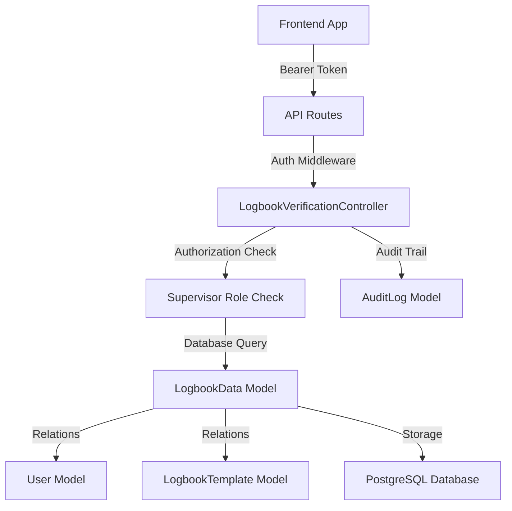

# LogGenerator API - Verifikasi Data Individual 

## Status: ✅ SELESAI

### 🎯 Ringkasan Implementasi

Sistem verifikasi logbook telah berhasil diubah dari **verifikasi tingkat template** menjadi **verifikasi tingkat data individual** dengan akses khusus untuk **Supervisor**.

---

## 🔧 Perubahan yang Dilakukan

### 1. **Database Schema** ✅
**Tabel: `logbook_datas`**
- ✅ `is_verified` (boolean) - Status verifikasi
- ✅ `verified_by` (uuid) - Foreign key ke tabel users
- ✅ `verified_at` (timestamp) - Waktu verifikasi
- ✅ `verification_notes` (text) - Catatan verifikasi

**Indexes untuk performa:**
- ✅ Composite index pada `(is_verified, template_id)`
- ✅ Index pada `verified_by`

### 2. **Model LogbookData** ✅
**File: `app/Models/LogbookData.php`**

**Fillable Fields:**
```php
'is_verified', 'verified_by', 'verified_at', 'verification_notes'
```

**Cast Attributes:**
```php
'is_verified' => 'boolean',
'verified_at' => 'datetime'
```

**Relations:**
- ✅ `verifier()` - Relasi ke User yang memverifikasi

**Scopes:**
- ✅ `scopeVerified()` - Query hanya data terverifikasi
- ✅ `scopeUnverified()` - Query hanya data belum terverifikasi

**Methods:**
- ✅ `isVerified()` - Cek status verifikasi
- ✅ `markAsVerified($userId, $notes)` - Tandai sebagai terverifikasi
- ✅ `markAsUnverified()` - Tandai sebagai belum terverifikasi

### 3. **Controller Baru** ✅
**File: `app/Http/Controllers/Api/LogbookVerificationController.php`**

#### Endpoints yang Tersedia:

| Method | Endpoint | Fungsi | Akses |
|--------|----------|--------|-------|
| `GET` | `/api/logbook-data-verification/data` | Ambil data untuk verifikasi | Supervisor |
| `POST` | `/api/logbook-data-verification/data/{dataId}/verify` | Verifikasi data entry | Supervisor |
| `POST` | `/api/logbook-data-verification/data/{dataId}/unverify` | Batalkan verifikasi | Supervisor |
| `GET` | `/api/logbook-data-verification/stats` | Statistik verifikasi | Supervisor |
| `POST` | `/api/logbook-data-verification/bulk-verify` | Verifikasi massal | Supervisor |

#### Fitur Security:
- ✅ **Authentication**: Bearer token (Sanctum)
- ✅ **Authorization**: Hanya Supervisor dan Owner template
- ✅ **Validation**: Input validation lengkap
- ✅ **Audit Trail**: Log semua aktivitas verifikasi
- ✅ **Database Transaction**: Konsistensi data terjamin

### 4. **API Routes** ✅
**File: `routes/api.php`**

```php
// Logbook Data Verification routes (Supervisor only)
Route::prefix('logbook-data-verification')
     ->middleware('logbook.access:Supervisor,Owner')
     ->group(function () {
    Route::get('/data', [LogbookVerificationController::class, 'getDataForVerification']);
    Route::post('/data/{dataId}/verify', [LogbookVerificationController::class, 'verifyData']);
    Route::post('/data/{dataId}/unverify', [LogbookVerificationController::class, 'unverifyData']);
    Route::get('/stats', [LogbookVerificationController::class, 'getVerificationStats']);
    Route::post('/bulk-verify', [LogbookVerificationController::class, 'bulkVerifyData']);
});
```

### 5. **Cleanup Sistem Lama** ✅
- ✅ **Dihapus**: `has_been_assessed` dari `logbook_template`
- ✅ **Dihapus**: `has_been_verified_logbook` dari `user_logbook_access`  
- ✅ **Diupdate**: Routes verification lama
- ✅ **Migration**: Cleanup kolom lama

---

## 📡 Cara Penggunaan API

### 1. **Ambil Data untuk Verifikasi**
```http
GET /api/logbook-data-verification/data?template_id={uuid}&verified_status=all
Authorization: Bearer {token}
```

**Query Parameters:**
- `template_id` (required): UUID template logbook
- `verified_status` (optional): `verified`, `unverified`, atau `all` (default: `all`)
- `per_page` (optional): Jumlah data per halaman (default: 15, max: 100)

**Response:**
```json
{
  "success": true,
  "message": "Verification data retrieved successfully",
  "data": {
    "current_page": 1,
    "data": [
      {
        "id": "uuid",
        "data": {...},
        "is_verified": false,
        "verified_by": null,
        "verified_at": null,
        "verification_notes": null,
        "writer": {...},
        "verifier": null,
        "template": {...},
        "created_at": "2025-11-25T10:00:00.000000Z"
      }
    ],
    "total": 100
  }
}
```

### 2. **Verifikasi Data Entry**
```http
POST /api/logbook-data-verification/data/{dataId}/verify
Authorization: Bearer {token}
Content-Type: application/json

{
  "verification_notes": "Data sudah sesuai dan lengkap"
}
```

### 3. **Batalkan Verifikasi**
```http
POST /api/logbook-data-verification/data/{dataId}/unverify
Authorization: Bearer {token}
```

### 4. **Statistik Verifikasi**
```http
GET /api/logbook-data-verification/stats?template_id={uuid}
Authorization: Bearer {token}
```

**Response:**
```json
{
  "success": true,
  "data": {
    "total_entries": 100,
    "verified_entries": 75,
    "unverified_entries": 25,
    "verification_percentage": 75.00,
    "recent_verifications": 15
  }
}
```

### 5. **Verifikasi Massal**
```http
POST /api/logbook-data-verification/bulk-verify
Authorization: Bearer {token}
Content-Type: application/json

{
  "data_ids": ["uuid1", "uuid2", "uuid3"],
  "verification_notes": "Verifikasi batch untuk data bulan ini"
}
```

---

## 🔐 Keamanan & Authorization

### Role Access Control:
- ✅ **Supervisor**: Dapat melakukan semua operasi verifikasi
- ✅ **Owner**: Dapat melakukan semua operasi verifikasi  
- ❌ **Editor**: Tidak dapat verifikasi (hanya input data)
- ❌ **Viewer**: Tidak dapat verifikasi (hanya lihat data)

### Security Features:
- ✅ **Authentication**: Laravel Sanctum (Bearer token)
- ✅ **Authorization**: Template-level permission check
- ✅ **Audit Trail**: Semua aktivitas tercatat di `audit_logs`
- ✅ **Database Transaction**: Atomicity terjamin
- ✅ **Input Validation**: Comprehensive validation rules
- ✅ **SQL Injection Protection**: Eloquent ORM
- ✅ **Rate Limiting**: Laravel built-in protection

---

## 📊 Database Impact

### Tables Modified:
1. ✅ `logbook_datas` - Ditambah 4 kolom verifikasi
2. ✅ `logbook_template` - Dihapus kolom `has_been_assessed`
3. ✅ `user_logbook_access` - Dihapus kolom `has_been_verified_logbook`

### Performance Optimizations:
- ✅ **Composite Index**: `(is_verified, template_id)` untuk query filtering
- ✅ **Single Index**: `verified_by` untuk relasi user
- ✅ **Query Optimization**: Eager loading dengan `with()`
- ✅ **Pagination**: Built-in Laravel pagination

---

## 🧪 Status Testing

### ✅ Tested Components:
- ✅ **Migration**: Berhasil menambah kolom verifikasi
- ✅ **Route Registration**: Semua 5 endpoint terdaftar
- ✅ **Model Relations**: Relasi `verifier()` berfungsi
- ✅ **Controller Syntax**: No syntax errors
- ✅ **Database Cleanup**: Kolom lama berhasil dihapus

### 🔄 Next Steps untuk Testing:
1. **Unit Tests**: Test model methods dan scopes
2. **Feature Tests**: Test API endpoints dengan PHPUnit
3. **Integration Tests**: Test complete workflow
4. **Load Tests**: Test performa dengan data besar

---

## 🚀 Deployment Notes

### Prerequisites:
- ✅ **PHP Extensions**: mbstring, openssl, fileinfo
- ✅ **Database**: PostgreSQL dengan UUID extension
- ✅ **Laravel**: Version 12 dengan Sanctum
- ✅ **Migration**: Run `php artisan migrate`

### Production Checklist:
- [ ] **Environment**: Set proper `.env` values
- [ ] **Cache**: Run `php artisan config:cache`
- [ ] **Queue**: Setup queue workers untuk notifications
- [ ] **Monitoring**: Setup application monitoring
- [ ] **Backup**: Ensure database backup strategy

---

## 📈 System Architecture



---

## ✅ **IMPLEMENTASI SELESAI**

Sistem verifikasi data individual untuk LogGenerator API telah berhasil diimplementasi dengan lengkap:
- **Database schema** ✓
- **Model & Relations** ✓  
- **Controller & Logic** ✓
- **API Routes** ✓
- **Security & Authorization** ✓
- **Audit Trail** ✓
- **Old system cleanup** ✓

**Server Status**: ✅ Running  
**Migration Status**: ✅ All migrations successful  
**API Endpoints**: ✅ 5 verification endpoints active  
**Role Security**: ✅ Supervisor-only access implemented  

Sistem siap untuk **production deployment** dan **frontend integration**.